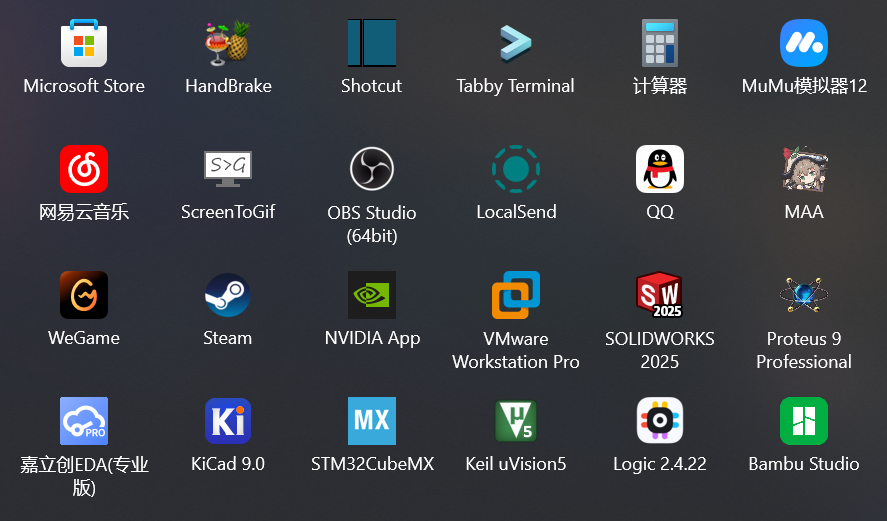

# 新电脑首次开机检查是否有开启BitLocker再重装系统

<details><summary>防止Windows推送旧版驱动</summary>

```
gpedit.msc —— 计算机配置 —— 管理模板 —— Windows 组件 —— Windows 更新 —— 管理从 Windows 更新提供的更新 —— Windows 更新不包括驱动程序
```

</details>

<details><summary>局域网文件共享</summary>

```
设置 —— 应用 —— 可选功能 —— 更多Windows功能 —— SMB 1.0/CIFS 文件共享支持、SMB直通

services.msc —— Function Discovery Resource Publication —— 自动
```

</details>
<details><summary>重装Windows默认APP</summary>

```powershell
Get-AppxPackage -AllUsers| Foreach {Add-AppxPackage -DisableDevelopmentMode -Register "$($_.InstallLocation)\AppXManifest.xml"}
```

</details>
<details><summary>关闭VBS</summary>

```
设置 —— 隐私和安全性 —— Windows安全中心 —— 设备安全性 —— 内核隔离详细信息 —— 内存完整性
```

```powershell
bcdedit /set hypervisorlaunchtype off
```

</details>
<details><summary>关闭虚拟内存(如果内存不够用就别关)</summary>

```
设置 —— 系统 —— 系统信息 —— 高级系统设置 —— 性能设置 —— 高级 —— 虚拟内存 —— 更改 —— 无分页文件 —— 设置并确定
```

</details>
<details><summary>关闭休眠模式</summary>

```powershell
powercfg -h off
```

</details>
<details><summary>CPU核数设置</summary>

```
msconfig
```

</details>
<details><summary>笔记本电源模式</summary>

```powershell
# 开启卓越性能
# 比起M1芯片的MacBook，Windows的调用CPU逻辑不太行，最好是用默认自带的平衡或者最佳能效模式
powercfg -duplicatescheme e9a42b02-d5df-448d-aa00-03f14749eb61

安静模式 40-90/70(电池)
均衡模式 60-99
野兽模式 99-100
```

</details>
<details><summary>一键解除所有UWP应用的网络隔离（CMD指令/PowerShell指令）</summary>

[Windows Loopback Exemption Manager](https://github.com/tiagonmas/Windows-Loopback-Exemption-Manager)(微软官方出品)、[Windows 8 AppContainer Loopback Utility](https://www.telerik.com/fiddler/add-ons)(第三方软件)

```cmd
FOR /F "tokens=11 delims=\" %p IN ('REG QUERY "HKCU\Software\Classes\Local Settings\Software\Microsoft\Windows\CurrentVersion\AppContainer\Mappings"') DO CheckNetIsolation.exe LoopbackExempt -a -p=%p
```

```powershell
Get-ChildItem -Path Registry::"HKCU\Software\Classes\Local Settings\Software\Microsoft\Windows\CurrentVersion\AppContainer\Mappings\" -name | ForEach-Object {CheckNetIsolation.exe LoopbackExempt -a -p="$_"}
```

</details>
<details><summary>WSL2代理设置</summary>

```shell
$ sudo vim ~./bashrc

# export windows_host=`cat /etc/resolv.conf|grep nameserver|awk '{print $2}'`
# export ALL_PROXY="socks5://$windows_host:2080"

# alias setproxy="export ALL_PROXY=socks5://$windows_host:2080"
# alias unsetproxy="unset ALL_PROXY"

git clone https://github.com/rofl0r/proxychains-ng
cd proxychains-ng
sudo apt install build-essential
./configure --prefix=/usr --sysconfdir=/etc
make && make install
make install-config
```

```shell
$ sudo vim /etc/proxychains.conf

quiet_mode
dynamic_chain
chain_len = 1
proxy_dns
remote_dns_subnet 224
tcp_read_time_out 15000
tcp_connect_time_out 8000
localnet 127.0.0.0/255.0.0.0
localnet 10.0.0.0/255.0.0.0
localnet 172.16.0.0/255.240.0.0
localnet 192.168.0.0/255.255.0.0

[ProxyList]
socks5  $windows_host 2080
# http    $windows_host 2081
```

</details>
<details><summary>CMD/PowerShell代理设置</summary>

```
系统 —— 关于 —— 高级系统设置 —— 环境变量 —— 用户变量新建
HTTP_PROXY http://127.0.0.1:2081
HTTPS_PROXY http://127.0.0.1:2081
```

```cmd
set http_proxy=http://127.0.0.1:2081
set https_proxy=http://127.0.0.1:2081
```

```powershell
$env:http_proxy="http://127.0.0.1:2081"
$env:https_proxy="http://127.0.0.1:2081"
```

</details>
<details><summary>git设置</summary>

```shell
# ssh代理配置文件路径：C:/Users/username/.ssh/config
Host github.com
    ProxyCommand connect -S localhost:2080 %h %p

# 指令的方式直接增加代理设置
git config --global http.https://github.com.proxy socks5://127.0.0.1:2080

# git配置文件路径：C:/Users/username/.gitconfig
[http "https://github.com"]
    proxy = socks5://127.0.0.1:2080

# 回车和换行符自动转换
git config --global core.autocrlf true
git add --renormalize .

# 使用ort策略merge
git config --global pull.twohead ort

# log美化
git config --global alias.lg "log --color --graph --abbrev-commit --decorate --date=relative --format=format:'%C(bold blue)%h%C(reset) - %C(bold green)(%ar)%C(reset) %C(white)%s%C(reset) %C(dim white)- %an%C(reset)%C(bold yellow)%d%C(reset)' --all"

# diff美化 https://github.com/banga/git-split-diffs
npm install -g git-split-diffs
git config --global core.pager "git-split-diffs --color | less -RFX"

# GPG相关设置
git config --global user.signingkey <密钥ID>
git config --global commit.gpgsign true
git config --global tag.forcesignannotated true
```

</details>
<details><summary>pip代理</summary>

```shell
已经在3.9.13版本后修复，不需要设置即可正常使用代理

# 新版pip的依赖库urllib3对于没有协议头的代理地址会强制增加https头并采用https协议连接，
# 而配置文件的优先级没有系统代理设置高所以对这个问题没有帮助
# 解决方法可以在windows代理设置中强制指定https代理地址为http或者设置临时环境变量

# pip config set global.index-url https://mirrors.aliyun.com/pypi/simple/
# pip config set global.trusted-host mirrors.aliyun.com
# pip config set global.proxy http://127.0.0.1:2081

# pip全局配置文件路径：C:/Users/username/AppData/Roaming/pip/pip.ini

# [global]
# index-url = https://mirrors.aliyun.com/pypi/simple/
# trusted-host = mirrors.aliyun.com
# proxy = http://127.0.0.1:2081
```

</details>
<details><summary>npm、yarn的代理/换源设置</summary>

```shell
npm config set proxy http://127.0.0.1:2081
npm config set https-proxy http://127.0.0.1:2081
npm config set registry https://registry.npmmirror.com

yarn config set proxy http://127.0.0.1:2081
yarn config set https-proxy http://127.0.0.1:2081
yarn config set registry https://registry.npmmirror.com
```

</details>
<details><summary>Maven、Gradle的代理/换源设置</summary>

```shell
# C:\Users\username\.m2\setting.xml

<proxies>
    <proxy>
        <active>true</active>
        <protocol>http</protocol>
        <host>127.0.0.1</host>
        <port>2081</port>
    </proxy>
</proxies>

<mirrors>
    <mirror>
        <id>aliyunmaven</id>
        <mirrorOf>*</mirrorOf>
        <name>阿里云公共仓库</name>
        <url>https://maven.aliyun.com/repository/public</url>
    </mirror>
</mirrors>

# C:\Users\username\.gradle\gradle.properties

systemProp.http.proxyHost=127.0.0.1
systemProp.http.proxyPort=2081
systemProp.https.proxyHost=127.0.0.1
systemProp.https.proxyPort=2081

# C:\Users\username\.gradle\init.gradle

allprojects {
    repositories {
        def ALIYUN_REPOSITORY_URL_PUBLIC = 'https://maven.aliyun.com/repository/public'
        def ALIYUN_REPOSITORY_URL_GOOGLE = 'https://maven.aliyun.com/repository/google'
        def ALIYUN_REPOSITORY_URL_GRADLE_PLUGIN = 'https://maven.aliyun.com/repository/gradle-plugin'
        def ALIYUN_REPOSITORY_URL_SPRING = 'https://maven.aliyun.com/repository/spring'
        def ALIYUN_REPOSITORY_URL_SPRING_PLUGIN = 'https://maven.aliyun.com/repository/spring-plugin'
        def ALIYUN_REPOSITORY_URL_GRAILS_CORE = 'https://maven.aliyun.com/repository/grails-core'
        def ALIYUN_REPOSITORY_URL_APACHE_SNAPSHOTS = 'https://maven.aliyun.com/repository/apache-snapshots'
        all {
            ArtifactRepository repo ->
                if (repo instanceof MavenArtifactRepository) {
                    def url = repo.url.toString()
                    if (url.startsWith('https://repo1.maven.org/maven2/')) {
                        project.logger.lifecycle "Repository ${repo.url} replaced by $ALIYUN_REPOSITORY_URL_PUBLIC."
                        remove repo
                    }
                    if (url.startsWith('https://jcenter.bintray.com/')) {
                        project.logger.lifecycle "Repository ${repo.url} replaced by $ALIYUN_REPOSITORY_URL_PUBLIC."
                        remove repo
                    }
                    if (url.startsWith('https://maven.google.com/')) {
                        project.logger.lifecycle "Repository ${repo.url} replaced by $ALIYUN_REPOSITORY_URL_GOOGLE."
                        remove repo
                    }
                    if (url.startsWith('https://plugins.gradle.org/m2/')) {
                        project.logger.lifecycle "Repository ${repo.url} replaced by $ALIYUN_REPOSITORY_URL_GRADLE_PLUGIN."
                        remove repo
                    }
                    if (url.startsWith('http://repo.spring.io/libs-milestone/')) {
                        project.logger.lifecycle "Repository ${repo.url} replaced by $ALIYUN_REPOSITORY_URL_SPRING."
                        remove repo
                    }
                    if (url.startsWith('http://repo.spring.io/plugins-release/')) {
                        project.logger.lifecycle "Repository ${repo.url} replaced by $ALIYUN_REPOSITORY_URL_SPRING_PLUGIN."
                        remove repo
                    }
                    if (url.startsWith('https://repo.grails.org/grails/core')) {
                        project.logger.lifecycle "Repository ${repo.url} replaced by $ALIYUN_REPOSITORY_URL_GRAILS_CORE."
                        remove repo
                    }
                    if (url.startsWith('https://repository.apache.org/snapshots/')) {
                        project.logger.lifecycle "Repository ${repo.url} replaced by $ALIYUN_REPOSITORY_URL_APACHE_SNAPSHOTS."
                        remove repo
                    }

                }
        }
        maven {
            url ALIYUN_REPOSITORY_URL_PUBLIC
            url ALIYUN_REPOSITORY_URL_GOOGLE
            url ALIYUN_REPOSITORY_URL_GRADLE_PLUGIN
            url ALIYUN_REPOSITORY_URL_SPRING
            url ALIYUN_REPOSITORY_URL_SPRING_PLUGIN
            url ALIYUN_REPOSITORY_URL_GRAILS_CORE
            url ALIYUN_REPOSITORY_URL_APACHE_SNAPSHOTS
        }
    }
}
```

</details>
<details><summary>golang代理设置</summary>

```shell
go env -w GO111MODULE=on
go env -w GOPROXY=https://mirrors.aliyun.com/goproxy/
```

</details>
<details><summary>GPG常用指令及配置文件</summary>

```shell
gpg --expert --full-generate-key # 生成密钥
gpg -ao revoke.pgp --generate-revocation <密钥ID> # 生成撤销凭证
gpg --list-keys/-k # 列出所有公钥
gpg --list-secret-keys/-K # 列出所有私钥

gpg --edit-key <密钥ID>
gpg> list # 列出所有子密钥
gpg> change-usage # 修改用途
gpg> key {n} # 选择序号为n的子密钥
gpg> trust # 设置信任度
gpg> expire # 设置过期时间
gpg> passwd # 更改密码
gpg> revkey # 撤销子密钥
gpg> save # 保存

gpg -ao public-key.asc --export <密钥ID> # 导出公钥
# 密钥ID后要加上"!", 不然会导出全部子密钥
gpg -ao secret-key.asc --export-secret-key <密钥ID>! # 导出主私钥
gpg -ao sign-subkey.asc --export-secret-subkeys <密钥ID>! # 导出子私钥

gpg --delete-secret-keys <密钥ID> # 删除私钥
gpg --delete-keys <密钥ID> # 删除公钥

gpg --import [密钥文件/撤销凭证] # 导入密钥

gpg --sign input.txt  # 给文档签名
gpg --clear-sign input.txt # 生成ASCII格式签名
gpg -ao output.asc --detach-sign input.txt # 签名和原文本分开
gpg --verify output.asc input.txt # 验证签名文件

gpg -ao output.asc -se input.txt -r <公钥ID> # 签名并加密文档
# s代表签名, e代表加密, r代表recipient, 指定接收者的公钥ID, a代表ASCII码格式, o代表输出地址,
gpg -ao input.txt -d output.asc # 解密
```

```shell
C:/Users/username/.gnupg/gpg.conf

keyid-format 0xlong
with-fingerprint
personal-cipher-preferences AES256
personal-digest-preferences SHA512
personal-compress-preferences Uncompressed
default-preference-list SHA512 AES256 Uncompressed
cert-digest-algo SHA512
s2k-cipher-algo AES256
s2k-digest-algo SHA512
s2k-mode 3
s2k-count 65011712
```

</details>
<details><summary>SSH密钥生成</summary>

```shell
ssh-keygen -t ed25519 -C "your_email@example.com"
```

</details>
<details><summary>APK签名相关</summary>

```shell
# https://docs.microsoft.com/zh-cn/xamarin/android/deploy-test/signing/manually-signing-the-apk
# https://docs.oracle.com/en/java/javase/17/docs/specs/man/keytool.html
# https://docs.oracle.com/en/java/javase/17/security/oracle-providers.html
keytool -genkeypair -alias SekiBetu -keyalg RSA -keysize 4096 -sigalg SHA3-512withRSA -dname "cn=SekiBetu,ou=,dc=,dc=China" -startdate "1970/01/01 00:00:00" -validity 365000 -storetype PKCS12 -keystore SekiBetu.p12 # 生成行业标准 PKCS12 格式的Java KeyStore
keytool -list -v -keystore SekiBetu.p12 # 查看 KeyStore 的详细信息
keytool -importkeystore -srckeystore SekiBetu.jks -srcstoretype JKS -destkeystore SekiBetu.jks -deststoretype pkcs12 # 转换 JKS 格式为行业标准 PKCS12 格式
zipalign -f -v 4 unsigned.apk optimized-unsigned.apk # APK优化
apksigner sign --ks SekiBetu.p12 --ks-key-alias SekiBetu optimized-unsigned.apk # 先优化后签名
```

</details>
<details><summary>Chrome & Edge Flags</summary>

```shell
Smooth Scrolling
【Chrome Only】Overlay Scrollbars
【Chrome Only】Windows 11 Mica titlebar
【Chrome Only】Chrome Refresh 2023
【Chrome Only】Chrome WebUI Refresh 2023
【Chrome Only】Power bookmarks side panel
Parallel downloading
【Chrome Only】Enable download bubble
【Chrome Only】Enable download bubble V2
【Chrome Only】Enable the high efficiency mode feature in the settings
【Edge Only】Microsoft Edge Share Menu
【Edge Only】Show Windows 11 visual effects in title bar and toolbar
【Edge Only】Make Rounded Tabs feature available
【Edge Only】Enable Smooth Scrolling for PDF
【Edge Only】Windows 11 fluent scrollbars.
【Edge Only】Enable Windows 11 Acrylic effect in menus
```

</details>
<details><summary>yt-dlp设置</summary>

```
设置文件目录：

C:\Users\username\AppData\Roaming\yt-dlp\config
```

```shell
--ignore-errors
--downloader aria2c
--downloader-args "-c -j 16 -s 16 -x 16 -k 1M"
--proxy http://127.0.0.1:2081/
-f 'bestvideo[ext=mp4]+bestaudio[ext=m4a]/best[ext=mp4]/best'
-o D:/Media/Videos/"%(uploader)s(%(uploader_id)s)/%(upload_date)s-%(title)s-(%(duration)ss)[%(resolution)s][%(id)s].%(ext)s"
--embed-metadata
--write-description
--write-thumbnail
```

</details>
<details><summary>ffmpeg</summary>

```shell
ffmpeg -hwaccel_output_format cuda -c:v h264_cuvid -i input.mp4 -vf ass=input.ass -c:v h264_nvenc -cq:v 19 output.mp4
```

</details>
<details><summary>IntelliJ IDEA设置备忘录</summary>

```shell
【IntelliJ IDEA启动参数】
文件目录：~\JetBrains\IntelliJIDEA\bin\idea64.exe.vmoptions
-Xms2048m
-Xmx2048m
-XX:ReservedCodeCacheSize=1024m
【皮肤设置】
Appearance & Behavior —— Appearance —— Theme：One Dark vivid
【启动IDEA时不自动打开项目】
Appearance & Behavior —— System Settings —— × Reopen last project on startup
【代理设置】
Appearance & Behavior —— System Settings —— HTTP Proxy —— Manual proxy configuration —— √ HTTP ; Host name：127.0.0.1 ; Port number：2081
【滚轮修改字体大小】
Editor —— General —— √ Change font size(Zoom) with Ctrl+Mouse Wheel
Editor —— General —— Scrolling —— √ Enable smooth scrolling (default on 2021.1.2) —— Move caret, minimize editor scrolling
【自动导包】[项目设置]
Editor —— General —— Auto Import —— Insert imports on paste：Always (default on 2021.1.2) ; √ Add Unambiguous imports on the fly ; √ Optimize imports on the fly
【设置行号显示】
Editor —— General —— Appearance —— √ Show line numbers (default on 2021.1.2) ; √ Show method separators
【忽略大小写】
Editor —— General —— Code Completion —— × Match case
【取消单行显示标签页】
Editor —— General —— Editor Tabs —— Show tabs in Multiple rows —— √ Show pinned tabs in a separate row
【悬浮提示】
Editor —— Code Editing —— √ Show quick documentation on mouse move (default on 2021.1.2)
【字体】
Editor —— Font —— Font: JetBrains Mono —— Size: 13 —— Line height: 1.2 (default on 2021.1.2)
Editor —— Font —— Fallback font：Sarasa Mono Slab SC
【自动换行】
Editor —— Code Style —— √ Wrap on typing
Editor —— Code Style —— Java —— Wrapping and Braces —— √ Ensure right margin is not exceeded
【单行注释斜杠跟着代码】
Editor —— Code Style —— Java —— Code Generation —— × Line comment at first column ; √ Add a space at comment start
【项目文件编码】[项目设置]
Editor —— File Encodings —— Global Encoding: UTF-8 ; Project Encoding: UTF-8 ; Default encoding for properties files: UTF-8 ; √ Transparent native-to-ascii conversion
【插件列表】
Plugins —— Lombok ; One Dark theme ; Rainbow Brackets ; Translation ; Maven Helper ; RestfulTool ; MybatisX ;
【自动编译项目】[项目设置]
Build, Execution, Deployment —— Compiler —— √ Build project automatically
【增加堆内存】[项目设置]
Build, Execution, Deployment —— Compiler —— Build process heap size(Mbytes): 2048
【翻译设置】
Tools —— Translation —— 常规 —— √ 使用translate.google.com ; —— 字体 —— 主要字体: Sarasa Mono Slab SC ; 音标字体: Sarasa Mono Slab SC
```

```shell
Code Style(schemes)
CodeInsight, DefaultFont, Editor, Error highlighting
Default Project[项目设置]
Editor Colors
General
HTTP Proxy
KotlinCodeInsightSettings
Settings
UI Settings

codestyles
- Default.xml
options
- colors.scheme.xml
- editor.codeinsight.xml
- editor.xml
- ide.general.xml
- project.default.xml[项目设置]
- proxy.settings.xml
- ui.lnf.xml
- yiiguxing.translation.xml
```

</details>

## Useful Websites

- [UUP dump](https://uupdump.ml/?lang=zh-cn)
- [423Down](https://www.423down.com/)
- [果核剥壳](https://www.ghpym.com/)
- [远景论坛](http://bbs.pcbeta.com/forum-win10-1.html)
- [lrepacks](https://lrepacks.net)

## Software List(Indispensable)

- [WinNTSetup](https://msfn.org/board/topic/149612-winntsetup)
- [微软运行库](https://github.com/abbodi1406/vcredist/releases)、[Official](https://docs.microsoft.com/zh-CN/cpp/windows/latest-supported-vc-redist?view=msvc-170)
- [Microsoft-Activation-Scripts](https://github.com/massgravel/Microsoft-Activation-Scripts/releases)、[CMWTAT_Digital_Edition](https://github.com/TGSAN/CMWTAT_Digital_Edition/releases)、`irm https://massgrave.dev/get | iex`
- [v2rayN](https://github.com/2dust/v2rayN/releases)
- [搜狗输入法](https://pinyin.sogou.com/)
- [Bandizip](https://www.bandisoft.com/bandizip/dl/)、[patch](https://www.423down.com/9735.html)、[7-Zip](https://www.7-zip.org/)、[NanaZip](https://github.com/M2Team/NanaZip/releases)
- [Chrome](https://www.google.com/intl/zh-CN/chrome/browser/thankyou.html?platform=win64&standalone=1&statcb=1&installdataindex=defaultbrowser)、[FireFox](https://www.mozilla.org/zh-CN/firefox/all/#product-desktop-release)
- [Visual Studio Code](https://code.visualstudio.com/)
- [火绒](https://www.huorong.cn/person5.html)
- [Logitech G HUB](https://support.logi.com/hc/zh-cn/articles/360025298133)
- [Intel Graphics Driver](https://www.intel.cn/content/www/cn/zh/download/19344/intel-graphics-windows-dch-drivers.html)、[arc version](https://www.intel.cn/content/www/cn/zh/download/726609/intel-arc-graphics-windows-dch-driver.html)、[Intel Extreme Tuning Utility](https://www.intel.cn/content/www/cn/zh/download/17881/intel-extreme-tuning-utility-intel-xtu.html)
- [GeForce Drivers](https://www.nvidia.cn/Download/Find.aspx?lang=cn)、[Display Driver Uninstaller](https://www.wagnardsoft.com/display-driver-uninstaller-ddu-)
- [Realtek High Definition Audio (HDA) Version WHQL](https://www.necacom.net/index.php/realtek/hda/)、[Realtek-UAD-generic](https://github.com/pal1000/Realtek-UAD-generic)
- [Intel Wi-Fi Drivers](https://www.intel.cn/content/www/cn/zh/download/19351/windows-10-and-windows-11-wi-fi-drivers-for-intel-wireless-adapters.html)、[Intel Wireless Bluetooth](https://www.intel.cn/content/www/cn/zh/download/18649/intel-wireless-bluetooth-for-windows-10-and-windows-11.html)
- [DriverStoreExplorer](https://github.com/lostindark/DriverStoreExplorer/releases)
- [TrafficMonitor](https://github.com/zhongyang219/TrafficMonitor/releases)
- [OpenHashTab](https://github.com/namazso/OpenHashTab/releases)
- [Everything](https://www.voidtools.com/zh-cn/downloads/)
- [Office Tool Plus](https://github.com/YerongAI/Office-Tool/releases)
- [QQ](https://im.qq.com/download/)、[RevokeMsgPatcher](https://github.com/huiyadanli/RevokeMsgPatcher)
- [Steam](https://store.steampowered.com/about/)
- [Ubisoft Connect](https://ubisoftconnect.com/zh-CN/)
- [WeGame](https://www.wegame.com.cn/)
- [HandBrake](https://github.com/HandBrake/HandBrake/releases)
- [便笺](https://www.microsoft.com/en-us/p/microsoft-sticky-notes/9nblggh4qghw)
- [Shotcut](https://github.com/mltframework/shotcut/releases)
- [ScreenToGif](https://github.com/NickeManarin/ScreenToGif/releases)
- [网易云音乐](https://music.163.com/#/download)
- [计算器](https://www.microsoft.com/en-us/p/windows-calculator/9wzdncrfhvn5)
- [WinSW](https://github.com/winsw/winsw/releases)
- [aria2](https://github.com/aria2/aria2/releases)
- [FFmpeg](https://github.com/BtbN/FFmpeg-Builds/releases)
- [N_m3u8DL-CLI](https://github.com/nilaoda/N_m3u8DL-CLI/releases)、[N_m3u8DL-RE](https://github.com/nilaoda/N_m3u8DL-RE)
- [yt-dlp](https://github.com/yt-dlp/yt-dlp/releases) `pip3 install --upgrade git+https://github.com/yt-dlp/yt-dlp.git` 、[youtube-dl(pip)](https://github.com/ytdl-org/youtube-dl/releases) `pip3 install --upgrade git+https://github.com/ytdl-org/youtube-dl.git` 、[Streamlink(pip)](https://github.com/streamlink/streamlink/releases) `pip3 install --upgrade git+https://github.com/streamlink/streamlink.git`
- [Snipaste](https://www.snipaste.com/)
- [MPV](https://github.com/hooke007/MPV_lazy)、[Potplayer](https://www.423down.com/3050.html)
- [Honeyview](https://www.bandisoft.com/honeyview/)、[NeeView](https://bitbucket.org/neelabo/neeview/wiki/Home)、[ImageGlass](https://github.com/d2phap/ImageGlass/releases)
- [Adobe software series](https://weibo.com/1112829033)
- [百度云](http://pan.baidu.com/download)
- [CCleaner](https://www.423down.com/716.html)、[Winapp2](https://github.com/MoscaDotTo/Winapp2)
- [Telegram](https://telegram.org/)
- [雷神加速器](https://www.leigod.com/)
- [蓝叠模拟器国际版](https://www.bluestacks.com/download.html)、[夜神模拟器](https://www.yeshen.com/)、[雷电安卓模拟器](https://www.ldmnq.com/)
- [qBittorrent-Enhanced-Edition](https://github.com/c0re100/qBittorrent-Enhanced-Edition/releases)、[tracker](https://github.com/XIU2/TrackersListCollection)、[tracker2](https://github.com/ngosang/trackerslist)
- [WinMerge](https://github.com/WinMerge/winmerge/releases)
- [LocalSend](https://github.com/localsend/localsend/releases)

## Software List(Optional)

- [Ventoy](https://github.com/ventoy/Ventoy/releases)、[UltraISO](https://www.ghpym.com/ultraiso.html)、[WinISO](https://www.ghxi.com/winiso.html)、[rufus](https://github.com/pbatard/rufus/releases)
- [Groupy](https://store.steampowered.com/app/912170)
- [Start11](https://store.steampowered.com/app/1811010/Start11)
- [BilibiliLiveRecordDownLoader](https://github.com/HMBSbige/BilibiliLiveRecordDownLoader/releases)、[DDTV](https://github.com/CHKZL/DDTV/releases)
- [K-Lite Codec Pack Mega](https://codecguide.com/download_k-lite_codec_pack_mega.htm)
- [Cheat Engine](https://cheatengine.org/)
- [mitmproxy(pip)](https://github.com/mitmproxy/mitmproxy) `pip3 install --upgrade git+https://github.com/mitmproxy/mitmproxy.git` 、[Fiddler Classic](https://www.telerik.com/download/fiddler)、[Fiddler Everywhere](https://www.telerik.com/download/fiddler-everywhere)
- [Waifu2x-Extension-GUI](https://github.com/AaronFeng753/Waifu2x-Extension-GUI/releases)
- [Open Broadcaster Software](https://obsproject.com/download)
- [drawio](https://github.com/jgraph/drawio)
- [VMware Workstation](https://www.ghpym.com/workstationlite.html)
- [SteamAchievementManager](https://github.com/gibbed/SteamAchievementManager/releases)、[fork](https://github.com/JDM170/SteamAchievementManager/releases)、[SAM-Auto](https://github.com/unencouraged/SAM-Auto/releases)、[Steam Achievement Abuser](https://github.com/sa68ru/Steam-Achievement-Abuser)
- [NatTypeTester](https://github.com/HMBSbige/NatTypeTester/releases)
- [IObit IObitUninstaller](https://www.423down.com/7732.html)
- [Subtitle Edit](https://github.com/SubtitleEdit/subtitleedit/releases)
- [Audacity](https://github.com/audacity/audacity/releases)
- [Driver Booster](https://www.423down.com/10421.html)

#### Recovery

- [EasyRecovery](https://www.423down.com/7904.html)
- [R-STUDIO Network](https://www.423down.com/8132.html)
- [DiskGenius](https://www.423down.com/8073.html)

## Developer Tools

- [Temurin](https://adoptium.net/)、[Oracle JDK](https://www.oracle.com/java/technologies/downloads/)
- [Windows Terminal](https://github.com/microsoft/terminal/releases)
- [Tabby](https://github.com/Eugeny/tabby/releases)
- [IntelliJ IDEA](https://www.jetbrains.com/idea/download/#section=windows)、[JetBrains Mono](https://www.jetbrains.com/lp/mono/)、[patch](https://zhile.io/)、[patch2](https://3.jetbra.in)
- [git](https://github.com/git-for-windows/git/releases)
- [jadx](https://github.com/skylot/jadx/releases)
- [Node.js](https://nodejs.org/zh-cn/download/)
- [Yarn](https://classic.yarnpkg.com/en/docs/install/#windows-nightly)
- [Python](https://www.python.org/downloads/)
- [MySQL](https://dev.mysql.com/downloads/windows/installer/5.7.html)
- [PowerShell](https://github.com/PowerShell/PowerShell/releases)
- [TDM-GCC](https://jmeubank.github.io/tdm-gcc/)

## 开始菜单布局



## Chrome Extensions

#### Pinned

- [Tab Muter](https://github.com/sersorrel/mute-tab)
- [哔哩哔哩助手](https://github.com/bilibili-helper/bilibili-helper-o)
- [FireShot](https://chrome.google.com/webstore/detail/take-webpage-screenshots/mcbpblocgmgfnpjjppndjkmgjaogfceg)
- [Shazam](https://chrome.google.com/webstore/detail/shazam-identify-songs-fro/mmioliijnhnoblpgimnlajmefafdfilb)
- [Bitwarden](https://chrome.google.com/webstore/detail/bitwarden-free-password-m/nngceckbapebfimnlniiiahkandclblb)
- [uBlock Origin](https://github.com/gorhill/uBlock)
- [uBO Minus (MV3)](https://chrome.google.com/webstore/detail/ubo-minus-mv3/ddkjiahejlhfcafbddmgiahcphecmpfh/related)
- [RSS Reader Extension (by Inoreader)](https://chrome.google.com/webstore/detail/rss-reader-extension-by-i/kfimphpokifbjgmjflanmfeppcjimgah)
- [贴吧签到助手](https://chrome.google.com/webstore/detail/bpheclmhommpomjoeoifcggjmdelgaoj)
- [Twitter Media Downloader](https://chrome.google.com/webstore/detail/twitter-media-downloader/cblpjenafgeohmnjknfhpdbdljfkndig)
- [EditThisCookie](https://github.com/ETCExtensions/Edit-This-Cookie)
- [SingleFile](https://github.com/gildas-lormeau/SingleFile)
- [魂签](https://github.com/inu1255/soulsign-chrome)
- [Stylus](https://github.com/openstyles/stylus)
- [Dark Reader](https://github.com/darkreader/darkreader/releases)
- [Violentmonkey](https://github.com/violentmonkey/violentmonkey)

#### Unpinned

- [Adobe Acrobat](https://chrome.google.com/webstore/detail/adobe-acrobat/efaidnbmnnnibpcajpcglclefindmkaj)
- [Augmented Steam](https://github.com/tfedor/AugmentedSteam)
- [EhSyringe](https://github.com/EhTagTranslation/EhSyringe)
- [Git Master](https://github.com/ineo6/git-master)
- [IDM Integration Module](https://chrome.google.com/webstore/detail/idm-integration-module/ngpampappnmepgilojfohadhhmbhlaek)
- [JSON Viewer](https://github.com/tulios/json-viewer)
- [mirigana](https://github.com/mirigana/mirigana)
- [Refined GitHub](https://github.com/refined-github/refined-github)
- [ScrollAnywhere](https://chrome.google.com/webstore/detail/scrollanywhere/jehmdpemhgfgjblpkilmeoafmkhbckhi)
- [Show YouTube comments while watching](https://github.com/tanguykurylo/show-youtube-comments)
- [Soul++](https://github.com/FetchTheMoon/soul-plus-plus-chrome-extension)
- [Steam Database](https://github.com/SteamDatabase/BrowserExtension)
- [TabCopy](https://chrome.google.com/webstore/detail/tabcopy/micdllihgoppmejpecmkilggmaagfdmb)
- [WebRTC Leak Prevent](https://github.com/aghorler/WebRTC-Leak-Prevent)
- [购物党自动比价工具](https://chrome.google.com/webstore/detail/%E8%B4%AD%E7%89%A9%E5%85%9A%E8%87%AA%E5%8A%A8%E6%AF%94%E4%BB%B7%E5%B7%A5%E5%85%B7/jgphnjokjhjlcnnajmfjlacjnjkhleah)

#### Not Using

- ~~[cat-catch](https://github.com/xifangczy/cat-catch)~~
- ~~[FeHelper](https://github.com/zxlie/FeHelper)~~
- ~~[QZoneExport](https://github.com/ShunCai/QZoneExport)~~
- ~~[uBlacklist](https://github.com/iorate/uBlacklist)、[中文搜索结果黑名单](https://github.com/cobaltdisco/Google-Chinese-Results-Blocklist)~~

<details><summary>字体及美化</summary>

- [更纱黑体(Iosevka+思源黑体)](https://github.com/be5invis/Sarasa-Gothic/releases)

- [JetBrainsMono](https://github.com/JetBrains/JetBrainsMono/releases)

- [致美化](https://zhutix.com/)
</details>
